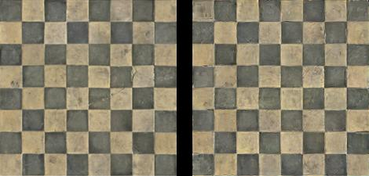

# Deep Correlations for Texture Synthesis


trial


<br><br><br>

### [[Code]](https://github.com/omrysendik/DCor/) [[Project page]](https://www.omrysendik.com/texturesynth2017/)   [[Paper]](https://docs.wixstatic.com/ugd/b1fe6d_f4f1684f6ba647ffbf1148c3721fdfc4.pdf)

Matlab implementation for Deep Correlations for Texture Synthesis.

This package our implementation for Deep Correlations for Texture Synthesis.
We did our best to make it a stande-alone package, meaning that we included ALL of the dependencies into this repository.
The code was written by [Omry Sendik](https://www.omrysendik.com).

## Prerequisites
- Linux
- Matlab R2015b

## Getting Started
### Installation
- Clone this repository
- Run synth.m while changing the 'First' flag to 1. This will compile everthing required and download the PreTrained CNN for you.

### Running
- Change the filename of the desired texture in line 20 of Synth.m. For example:
```
origSrcImg = imread(strrep('.\Data\Texture13.png','\',filesep));
```
- Note that the current code reflects the choice of Hyper-Parameters as described in the paper. If you wish to alter these, tweak GetSynthParams.m

- Now, patiently wait for the result to converge. If things are working properly, you should get an plot similar to this:



- The results will be saved to `./Data/Output/`

## Dataset
Download our dataset from 

## Citation
If you use this code for your research, please cite our [paper](https://junyanz.github.io/CycleGAN/):

```
@article{sendik2017deep,
  title={Deep correlations for texture synthesis},
  author={Sendik, Omry and Cohen-Or, Daniel},
  journal={ACM Transactions on Graphics (TOG)},
  volume={36},
  number={5},
  pages={161},
  year={2017},
  publisher={ACM}
}
```

## Related Projects:
[pix2pix](https://github.com/phillipi/pix2pix): Image-to-image translation using conditional adversarial nets  
[iGAN](https://github.com/junyanz/iGAN): Interactive Image Generation via Generative Adversarial Networks

## Cat Paper Collection
If you love cats, and love reading cool graphics, vision, and learning papers, please check out the Cat Paper Collection:  
[[Github]](https://github.com/junyanz/CatPapers) [[Webpage]](http://people.eecs.berkeley.edu/~junyanz/cat/cat_papers.html)

## Acknowledgments
Code borrows from [pix2pix](https://github.com/phillipi/pix2pix) and [DCGAN](https://github.com/soumith/dcgan.torch). The data loader is modified from [DCGAN](https://github.com/soumith/dcgan.torch) and  [Context-Encoder](https://github.com/pathak22/context-encoder). The generative network is adopted from [neural-style](https://github.com/jcjohnson/neural-style) with [Instance Normalization](https://github.com/DmitryUlyanov/texture_nets/blob/master/InstanceNormalization.lua).

