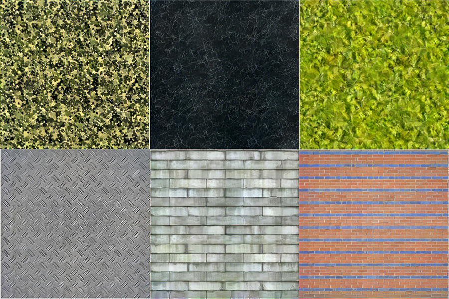

# Deep Correlations for Texture Synthesis



<br>

### [[Code]](https://github.com/omrysendik/DCor/) [[Project page]](https://www.omrysendik.com/texturesynth2017/) [[Paper]](https://docs.wixstatic.com/ugd/b1fe6d_f4f1684f6ba647ffbf1148c3721fdfc4.pdf) [[Results]](https://www.omrysendik.com/texturesynth2017results)

Matlab implementation for **Deep Correlations for Texture Synthesis**.

This package includes our implementation for **Deep Correlations for Texture Synthesis**.
We did our best to make it a stande-alone package, meaning that we included ALL of the dependencies into this repository.
The code was written by [Omry Sendik](https://www.omrysendik.com).

## Prerequisites
- Linux
- Matlab R2015b

## Getting Started
### Installation
- Clone this repository
- Run synth.m while changing the 'First' flag to 1. This will compile everthing required and download the PreTrained CNN for you. After running for the first time successfully, you may change 'First' to 0.

### Running
- Change the filename of the desired input texture in line 20 of Synth.m to reflect your desired input. For example:
```
origSrcImg = imread(strrep('.\Data\Texture13.png','\',filesep));
```
- Note that the current code reflects the choice of Hyper-Parameters as described in the paper. If you wish to alter these, tweak GetSynthParams.m

- Now, patiently wait for the result to converge. If things are working properly, you should get a plot similar to this:


- The results will be saved to `./Data/Output/`

## Dataset
Download our dataset from this repository too [[data]](https://github.com/omrysendik/DCor/tree/master/Data)


## Citation
If you use this code for your research, please cite our [paper](https://junyanz.github.io/CycleGAN/):

```
@article{sendik2017deep,
  title={Deep correlations for texture synthesis},
  author={Sendik, Omry and Cohen-Or, Daniel},
  journal={ACM Transactions on Graphics (TOG)},
  volume={36},
  number={5},
  pages={161},
  year={2017},
  publisher={ACM}
}
```
## Acknowledgments
Code relies heavily on:
[MatConvNet](http://www.vlfeat.org/matconvnet/): MatConvNet <br>
[L-BFGS-B](http://users.eecs.northwestern.edu/~nocedal/lbfgsb.html): L-BFGS-B for Matlab
